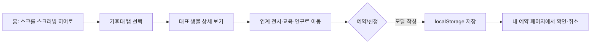

# 🌿 NIERenew — 국립생태원 웹사이트 리뉴얼

> 정적인 기관 홈페이지를 넘어, 스크롤 자체가 탐험이 되는 인터랙티브 생태문화 플랫폼

배포 링크: [바로가기](https://younsang5122.github.io/NIERenew/) · 노션 기획서: [바로가기](https://app.notion.com/p/Project-3-3c3a60f26a9a82e9bcbf8150e4e6fc47?source=copy_link) · 디자인 시안: [바로가기](https://www.figma.com/design/ww2gsa8b2BumDP82pMW84t/%EA%B5%AD%EB%A6%BD%EC%83%9D%ED%83%9C%EC%9B%90-%EB%A6%AC%EB%89%B4%EC%96%BC?node-id=24-414&t=yRBfx9IDdjqKxIuY-1)

## ✨ 주요 기능 & 인터랙션

### 1. 스크롤 스크러빙 드론 히어로
메인 화면 상단에서 **스크롤을 조종간처럼** 사용해 국립생태원 상공을 비행하는 드론 항공 촬영 시퀀스를 직접 탐험합니다. 텍스트·버튼·고도/좌표 텔레메트리는 화면에 고정(sticky)된 채, 배경 프레임 이미지만 스크롤 진행률에 맞춰 교체되어 "스크롤 = 비행 진행도"라는 감각을 만듭니다. 프레임 이미지가 아직 준비되지 않은 환경에서도 자동으로 정적 이미지로 폴백되어 화면이 깨지지 않습니다.

### 2. 기후대별 생태 탐험 탭 + 지도 연동
열대·사막·온대·극지 4개 기후관을 탭으로 전환하면 해당 생태계의 대표 생물이 즉시 그려지고, 지도 위 핀을 클릭해도 같은 탭으로 연결됩니다. URL 쿼리(`?eco=`)로 특정 기후대를 바로 열 수 있어, 다른 페이지의 연구자료나 생물 카드에서도 딥링크로 진입할 수 있습니다.

### 3. 예약·신청 시스템 (모달 + 내 예약 페이지)
전시·교육 프로그램 카드의 "예약하기"/"신청하기" 버튼을 이벤트 위임 방식으로 자동 감지해 예약 모달을 띄웁니다. 입력한 예약 정보는 `localStorage`에 저장되어 새로고침·재방문 후에도 유지되며, 헤더의 "내 예약" 뱃지 숫자와 실시간으로 동기화됩니다. `reservations.html`에서 예약 목록 확인과 취소가 가능합니다.

### 4. 생태 데이터 시각화
연구자료 중 수치 데이터(예: 한반도 기온 변화 추이)는 사진 카드를 클릭하면 외부 라이브러리 없이 순수 캔버스로 그린 라인 차트로 전환됩니다. 그래프는 반응형 리사이즈를 지원하고, 다시 "사진으로 보기" 버튼으로 원래 이미지로 되돌릴 수 있습니다.

### 5. 통합 검색 자동완성
헤더 검색창과 `data.html`의 큰 검색창 어디서 입력해도 생물·생태계·전시·교육·연구 데이터를 하나의 인덱스로 통합 검색합니다. 입력 즉시 드롭다운으로 결과가 노출되며, 정확히 일치하는 항목이 없어도 생물 도감 페이지로 이동해 검색어 기준 필터 결과(또는 "결과 없음" 안내)를 보여주어 검색이 막히지 않도록 설계했습니다.

### 6. 카드 3D 틸트 & 스크롤 패럴랙스
생물·프로그램 카드에 마우스를 올리면 포인터 위치에 따라 원근감 있게 기울고 빛이 스치는 글레어 효과가 함께 움직입니다. 각 섹션 제목·설명·카드들은 스크롤 진입 진행도에 맞춰 연속적으로(스크러빙 방식) 나타나며, 데이터 로드 후 동적으로 추가되는 카드에도 `MutationObserver`로 자동 적용됩니다.

## 🧭 사용자 플로우


## 🗂️ 폴더 구조
```
├── index.html                 # 생태 탐험 (홈)
├── species.html                # 생물 발견 (도감·상세)
├── exhibition.html             # 전시·관람 안내
├── education.html              # 교육·연구 프로그램
├── data.html                   # 생태 자료 (통합 검색·연구 데이터)
├── reservations.html           # 내 예약
├── css/
│   ├── style.css                # 디자인 시스템(컬러·타이포·헤더·푸터)
│   ├── home.css                 # 스크럽 히어로·기후대 탭·지도
│   ├── components.css           # 필터·요금표·동선·데이터 패널
│   └── reserve.css              # 예약 모달·내 예약 목록
├── js/
│   ├── main.js                   # 내비게이션 토글, 스크롤 리빌
│   ├── scrub.js                  # 드론 프레임 시퀀스 스크러빙 엔진
│   ├── scrollscrub.js            # 히어로 HUD·섹션 헤드·탭 시차 리빌
│   ├── parallax.js               # [data-parallax] 카드 스크롤 패럴랙스
│   ├── tilt.js                   # 카드 3D 틸트·글레어 인터랙션
│   ├── chart.js                  # 캔버스 라인 차트(연구 데이터 시각화)
│   ├── data.js                   # data/*.json 로드 및 각 페이지 렌더링, 통합 검색
│   └── reserve.js                # 예약 모달 + localStorage 예약 CRUD
└── data/
    ├── species.json / ecosystems.json / exhibitions.json
    └── education.json / research.json
```

## 🤖 AI 활용 프로세스
이 프로젝트는 기획 초안부터 트러블슈팅까지 각 단계에서 AI를 1차 초안 생성 도구로 활용하고, 그 결과를 검증·수정하는 방식으로 진행했습니다.

**① 기획 단계 — 인터뷰 기반 문제 정의**
관람객·학부모 대상 인터뷰 요약본을 넘겨 반복되는 pain point를 뽑아달라고 요청했습니다.
> "너는 UX 리서처야. 아래 관람객 인터뷰 요약을 보고 반복적으로 나타나는 불편함 3가지를 뽑고, 각각을 'OO 사용자는 ~하기 때문에 ~하지 못한다' 형식으로 정리해줘."

AI가 뽑은 pain point 중 "정적인 사진 위주 전시 안내로는 사전에 기대감을 갖기 어렵다"는 항목을 핵심으로 채택해, 스크롤 스크러빙 히어로와 기후대 탭 구조의 우선순위를 직접 정했습니다.

**② 디자인 단계 — 접근성 기준 리서치**
스크롤 애니메이션이 많은 사이트인 만큼, 모션에 민감한 사용자를 위한 기준을 먼저 받았습니다.
> "스크롤 기반 애니메이션이 많은 웹사이트의 웹 접근성 가이드를 만들어줘. prefers-reduced-motion 대응 방식, 대체 콘텐츠 제공 기준을 표로 정리해줘."

AI가 제안한 "애니메이션을 완전히 제거"하는 방식 대신, 실제로는 모든 스크립트(`scrub.js`, `scrollscrub.js`, `parallax.js`)에 `prefers-reduced-motion` 분기를 넣어 최종 상태로 즉시 표시하도록 직접 구현을 조정했습니다.

**③ 개발 단계 — 컴포넌트 초안 생성**
원하는 동작을 자연어로 설명해 코드 초안을 먼저 받았습니다.
> "바닐라 JS로 예약 신청 버튼을 누르면 모달이 뜨고, 폼 제출 시 localStorage에 예약 목록으로 저장되는 컴포넌트를 만들어줘. 페이지에 나중에 추가되는 카드의 버튼에도 자동으로 동작해야 해."

AI가 만든 초기 코드는 버튼에 직접 이벤트를 바인딩해 동적으로 생성된 카드에는 적용되지 않는 문제가 있어, 이벤트 위임(document 레벨 클릭 리스너) 방식으로 직접 수정해 해결했습니다.

**④ 카피라이팅 — 화면 문구 다듬기**
히어로 텔레메트리(고도·좌표 등)와 안내 문구도 AI로 여러 톤을 받아본 뒤 선택했습니다.
> "드론 항공 촬영 스크롤 히어로에 어울리는 짧은 텔레메트리 라벨(고도, 좌표, 프레임 등)과 스크롤 유도 문구를 영문 라벨로 제안해줘."

AI가 제안한 문구 중 지나치게 게임스럽게 느껴지는 표현("MISSION START" 등)은 제외하고, "Altitude", "Coordinates"처럼 실제 항공 촬영 다큐멘터리에 가까운 담백한 표현으로 직접 다듬었습니다.

**⑤ 트러블슈팅 — 원인 진단**
버그가 발생했을 때도 증상을 설명해 원인 후보를 먼저 받아본 뒤, 실제 원인을 좁혀 나갔습니다. (아래 트러블슈팅 표 참고)

> 전체 기획 단계(니즈분석·컨셉설정)의 프롬프트는 노션 기획서에서 더 자세히 볼 수 있습니다.

## 🩹 트러블슈팅
| 이슈 | 원인 | 해결 |
|---|---|---|
| 스크롤 시 카드가 미세하게 떨리는(jitter) 현상 | `parallax.js`와 신규 스크러빙 스크립트가 같은 요소의 `transform`을 매 프레임 각각 다른 값으로 덮어씀 | 담당 영역을 분리 — `data-parallax`가 이미 붙은 요소(생물 카드, 연계 프로그램)는 기존 `parallax.js`에 위임하고, 신규 스크립트는 히어로 HUD·섹션 헤드·탭 등 겹치지 않는 영역만 전담 |
| 새로고침 시 예약 내역이 사라짐 | 초기 구현이 예약 목록을 JS 변수에만 저장 | `localStorage` 기반 저장(`nie_reservations`)으로 전환, 헤더 뱃지와 `updateBadge()`로 동기화 |
| 드론 프레임 이미지가 없는 환경에서 히어로가 빈 화면으로 보임 | `assets/frames/scrub_001.jpg` 등 프레임 시퀀스 미준비 시 첫 프레임 로드 실패를 감지하지 못함 | 첫 프레임 로드 실패 시 정적 이미지(`ecorium-dome-wide.jpg`)로 자동 폴백하는 분기 추가 |
| 통합 검색에서 정확히 일치하는 결과가 없으면 아무 반응이 없음 | 검색 제출 핸들러가 매치 실패 시 페이지 이동을 하지 않음 | 매치가 없어도 생물 도감 페이지로 이동해 검색어(`?q=`) 기준 필터 결과 또는 "결과 없음" 안내를 표시하도록 수정 |

## 📄 저작권표시
© 2026 조윤상. All Rights Reserved.
